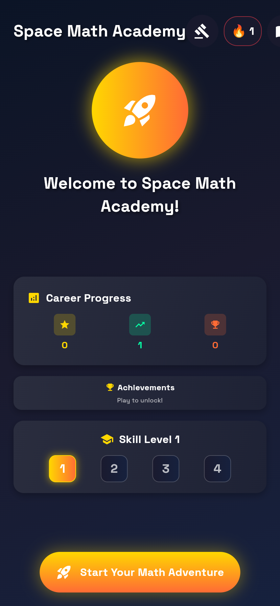
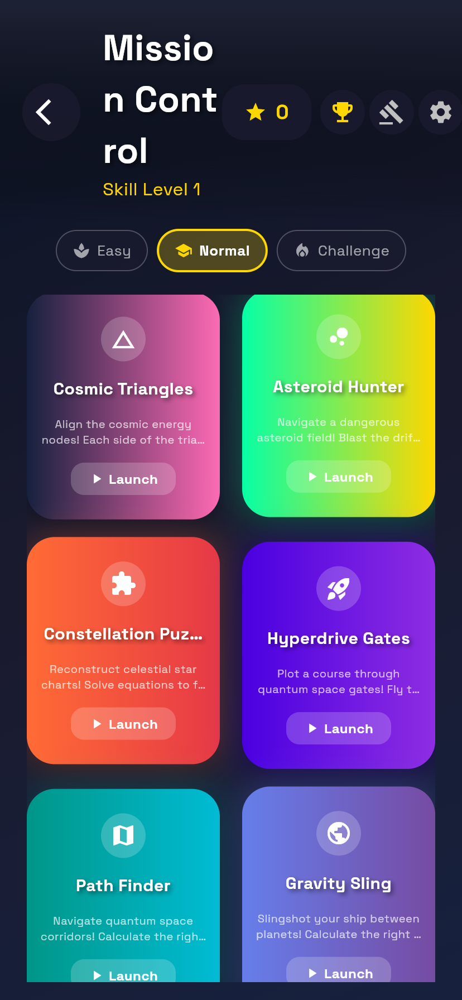
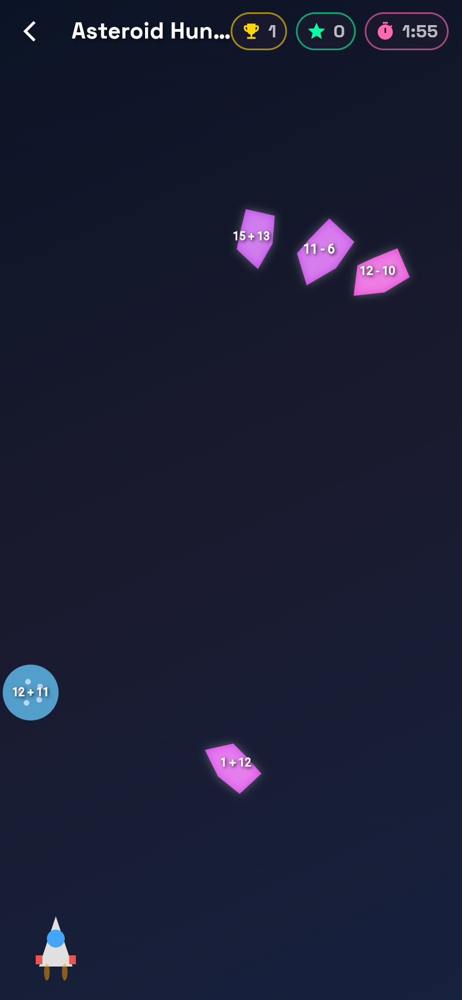

# 🚀 NumberNebula

A space-themed math learning app for primary school students onwards. Features engaging mini-games including Magic Triangles, arithmetic puzzles, and visual spatial games.

**🌐 Live demo (web build):** [numbernebula.vercel.app](https://numbernebula.vercel.app) — auto-deployed from `main`.

## 📱 Screenshots

<p align="center">
  
  &nbsp;
  
  &nbsp;
  
</p>

<p align="center"><sub>Home · Mission Control menu · Asteroid Hunter gameplay (captured from the Flutter web build)</sub></p>

## ✨ Features

### 🎮 Mini Games

  - **Cosmic Triangles** (`magic_triangles`): Solve mathematical triangle puzzles where each side adds up to the same cosmic frequency.
  - **Asteroid Field Hunter** (`asteroid_math`): Blast drifting space rocks in the correct numerical sequence before they collide.
  - **Constellation Puzzles** (`puzzle_math`): Reconstruct celestial star charts\! Solve equations to find the correct coordinates and lock star fragments into place.
  - **Hyperdrive Gates** (`hyperdrive_gates`): Pilot a spaceship through gates with the correct answer to a math problem while avoiding obstacles.
  - **Path Finder** (`pathfinder`): Navigate quantum space corridors\! Calculate the right trajectory through dangerous cosmic phenomena.
  - **Gravity Sling** (`planet_hopping`): Slingshot your ship between planets\! Calculate the right trajectory and visit planets in the correct mathematical sequence.
  - **Number Walls** (`number_walls`): Build cosmic calculation pyramids\! Stabilize the quantum structure by finding the missing blocks.
  - **Codebreaker** (`codebreaker`): Intercept and decode alien transmissions\! Solve complex equation systems to reveal their secrets.
  - **Anomaly Scan** (`perspective_puzzle`): Scan space objects with different sensor perspectives, matching 2D readouts to a 3D hologram.
  - **3D Block Counter** (`block_counter`): Rotate and count all blocks in a complex 3D structure, including hidden ones.
  - **Signal Triangulation** (`signal_triangulation`): A Mastermind-style logic puzzle where players must deduce a secret sequence of frequencies.
  - **Cryptex Lock Breaker** (`cryptex_lock_breaker`): Solve a system of interlocking mathematical equations to determine the correct combination for a series of rotating dials.
  - **Arithmancer's Duel** (`arithmancer_duel`): A turn-based card game where players craft mathematical expressions to defeat an AI opponent, by achieving certain numerical properties.
  - **Arithmetic Square** (`arithmatic_square`): Fill a grid of empty cells with numbers from a pool to satisfy all horizontal and vertical equations.
  - **Arithmancer Crosswords** (`arithmancer_crosswords`): Solve a math-based crossword puzzle by placing numbers in a grid to complete intersecting arithmetic equations.
  - **Kenken** (`kenken`): Fill a grid such that no digit repeats in any row or column, while also satisfying the mathematical constraints within "cages."
  - **Asteroid Field Navigator** (`asteroid_field_navigator`): A Minesweeper-style logic game. Reveal safe sectors and flag hidden asteroids based on numeric clues.
  - **Cargo Bay Arranger** (`cargo_bay_arranger`): A Tetris-style arithmetic game. Clear rows by filling them, with bonuses for creating rows that sum to a target number or feature certain numerical properties.
  - **Molecule Builder** (`quantum_molecule_builder`): A 2D spatial "Atomix"-puzzle where you slide atoms on a grid to match a target molecule.
  - **Space Station Gridlock** (`space_station_gridlock`): A "Rush Hour" style logic puzzle. Slide other ships horizontally or vertically to clear a path for your ship to reach the exit.
  - **Cargo-Loader** (`star_loader_game`): A classic "Sokoban" style puzzle: Push cargo crates onto their designated target squares in a complex warehouse.
  - **Robot Path** (`robot_path_game`): Program a robot with a sequence of commands (move, turn, jump, etc) to navigate a 2D grid and reach a goal.

### 🌟 Key Features

  - **Multi-language support**: English & German (i18n)
  - **Grade-specific content**: Tailored for school grades 1-4 or -6 (mapped to Skill Levels 1-4)
  - **Adaptive Difficulty**: Automatically adjusts problems based on player skill (can be toggled in settings).
  - **Customizable Practice**: Users can select specific operations (e.g., only multiplication) and number ranges.
  - **Spaced Repetition System (SRI)**: Arithmetic games use an SRI service to track mastery of individual math facts (e.g., `8 * 7`) and re-introduce problems the user struggles with.
  - **Cognitive Profile**: Non-arithmetic games track mastery by skill (e.g., `spatial3d`, `logicDeduction`) to adjust difficulty.
  - **Space theme**: Immersive cosmic design with animations
  - **iPad optimized**: Landscape orientation, large touch targets
  - **Achievement system**: Unlock space explorer achievements
  - **Progress tracking**: Save and monitor learning progress

## 🛠️ Setup Instructions

### Prerequisites

  - Flutter SDK (3.10.0 or higher)
  - Dart SDK (3.0.0 or higher)
  - Xcode (for iOS/macOS builds)
  - Android Studio (for Android builds)

### Installation

1.  **Clone the project**

    ```bash
    git clone https://github.com/CrispStrobe/space_math_academy.git
    cd space_math_academy
    ```

2.  **Install dependencies**

    ```bash
    flutter pub get
    ```

3.  **Set up localization**

    ```bash
    flutter gen-l10n
    ```

4.  **Create asset directories**

    ```bash
    mkdir -p assets/{images,sounds,animations,fonts}
    ```

5.  **Add font files** (optional - the app will work with system fonts)

      - Download Space Grotesk font family
      - Place in `assets/fonts/`

## 📱 Running the App

### Development

```bash
# Run in debug mode
flutter run

# Run on specific device (e.g., iPad simulator)
flutter run -d "iPad Simulator"

# Hot reload during development
# Press 'r' in terminal while app is running
```

### Building for iOS (iPad)

```bash
# Build for device (requires code signing)
flutter build ios --release
```

### Building for other platforms

```bash
# Android (phone/tablet)
flutter build apk

# Web
flutter build web

# macOS
flutter build macos
```

## 🎨 Assets Setup

### Required Assets

Create placeholder files or add real assets in the folders defined in `pubspec.yaml`:

```
assets/
├── images/
│   ├── app_icon.png (1024x1024)
│   └── ... (other images)
├── sounds/
│   ├── correct.mp3
│   └── ... (other sounds)
├── animations/
│   └── ... (Lottie/Rive animations)
└── fonts/
    ├── SpaceGrotesk-Regular.ttf
    └── SpaceGrotesk-Bold.ttf
```

## 🔧 Configuration

### iOS Configuration

Add to `ios/Runner/Info.plist`:

```xml
<key>UIInterfaceOrientationSupported</key>
<array>
    <string>UIInterfaceOrientationLandscapeLeft</string>
    <string>UIInterfaceOrientationLandscapeRight</string>
</array>
<key>UISupportedInterfaceOrientations~ipad</key>
<array>
    <string>UIInterfaceOrientationLandscapeLeft</string>
    <string>UIInterfaceOrientationLandscapeRight</string>
</array>
```

### App Icon

Generate app icons for all platforms:

```bash
flutter pub run flutter_launcher_icons
```

## 🎯 Game Types & Grade Levels

The app uses 4 internal Skill Levels that roughly map to school grades.

### Skill Level 1 

  - **Description**: Basic addition, subtraction, and simple multiplication
  - **Examples**: 5 + 8, 15 - 7, 3 × 4

### Skill Level 2 

  - **Description**: Multi-digit arithmetic and introduction to division
  - **Examples**: 25 + 37, 48 - 19, 6 × 7, 24 ÷ 6

### Skill Level 3 

  - **Description**: Complex operations, fractions, and decimals
  - **Examples**: 67 + 89, 85 - 38, 9 × 12, 72 ÷ 8

### Skill Level 4 

  - **Description**: Advanced math, logic puzzles, and multi-step problems
  - **Examples**: 156 + 287, 201 - 89, 15 × 18, 144 ÷ 12

## 🏆 Achievement System

### Score-based Achievements

  - **First Century**: Score 100 points
  - **Score Master**: Score 500 points
  - **Thousand Club**: Score 1000 points

### Progress Achievements

  - **Level Explorer**: Reach level 5
  - **Space Commander**: Reach level 10
  - **All-Rounder**: Play 3 or more different game types

### Game-specific Achievements

  - **Triangle Wizard**: Complete 3 Magic Triangle levels
  - **Bubble Popper**: Complete 3 Bubble Math levels
  - **Puzzle Solver**: Complete 3 Puzzle Math levels
  - **Number Walls Pro**: Complete 3 Number Walls levels
  - **Codebreaker Pro**: Complete 3 Codebreaker levels
  - **Arithmetic Ace**: Reach Level 5 in both Arithmetic Square and Arithmancer Crosswords
  - **Logic Grid Master**: Reach Level 5 in Kenken

## 🌍 Internationalization (i18n)

The app supports:

  - **English (en)**: Default language
  - **German (de)**: Deutsch

### Adding New Languages

1.  Create new `.arb` file in `lib/l10n/`
2.  Add translations for all keys
3.  Run `flutter gen-l10n`
4.  Update supported locales in `main.dart`

## 📊 Progress Tracking

### Data Persistence

Uses `shared_preferences` for:

  - Settings (sound, music, language, difficulty)
  - Game progress (per-game level tracking)
  - Achievement status
  - `SriService` database (arithmetic fact mastery)
  - `CognitiveProfileService` database (spatial/logic skill mastery)

## 🔍 Troubleshooting

### Common Issues

**Localization not working:**

```bash
flutter clean
flutter pub get
flutter gen-l10n
```

**iOS build fails:**

  - Check Xcode version compatibility
  - Verify code signing settings
  - Clean build folder: `flutter clean`

**Assets not loading:**

  - Verify file paths in `pubspec.yaml`
  - Check asset file existence
  - Run `flutter pub get` after asset changes

## 🚀 Deployment

### iOS App Store

1.  Configure app metadata in Xcode
2.  Set up provisioning profiles
3.  Build release version: `flutter build ios --release`
4.  Archive and upload via Xcode

### TestFlight Distribution

1.  Build and archive in Xcode
2.  Upload to App Store Connect
3.  Add external testers
4.  Distribute for testing

## 🤝 Contributing

### Code Style

  - Follow Dart/Flutter style guidelines
  - Comment complex game logic
  - Maintain consistent theming

### Adding New Games

1.  Create new game screen in `features/games/screens/`
2.  Add game's unique key and `SkillCategory` to `core/models/skill_category.dart`
3.  Add game to `_getGamesList` in `features/games/screens/game_menu_screen.dart`
4.  Update localization files with new game's title and description
5.  Add new achievements to `features/games/providers/game_provider.dart`

## 📝 License

This project is created for educational purposes. Please ensure compliance with any third-party assets or fonts used.

**Happy coding and may the mathematical force be with you\! 🚀✨**